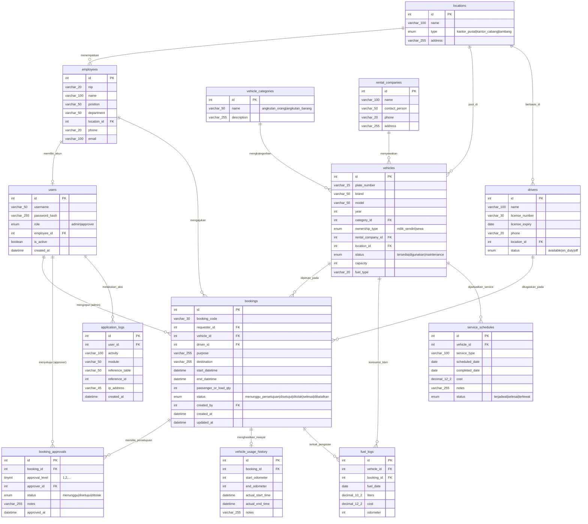
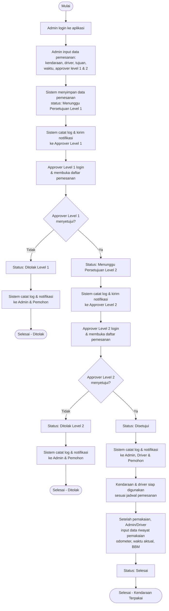

# Physical Data Model & Activity Diagram — Fitur Pemesanan Kendaraan

Dokumen ini berisi rancangan Physical Data Model (ERD) dan Activity Diagram untuk fitur pemesanan kendaraan pada aplikasi monitoring kendaraan tambang nikel. Skenario yang digunakan: pemesanan diinput oleh admin, ditugaskan ke driver, dan harus disetujui secara berjenjang minimal 2 level sebelum kendaraan bisa dipakai.

## 1. Physical Data Model (ERD)

Model ini fokus ke tabel-tabel yang berhubungan langsung dengan fitur pemesanan kendaraan (`bookings`, `booking_approvals`), ditambah tabel pendukung: user & pegawai, lokasi/region (kantor pusat, kantor cabang, 6 tambang), kendaraan (milik sendiri maupun sewa), driver, riwayat pemakaian, konsumsi BBM, jadwal service, dan log aplikasi.

### Catatan Desain

- `booking_approvals` dipisah dari `bookings` supaya approval berjenjang minimal 2 level bisa didukung, dan bisa ditambah level ke-3 dst tanpa ubah struktur tabel (dibedakan lewat kolom `approval_level`).
- `vehicle_usage_history` mencatat data aktual (odometer, waktu riil) setelah kendaraan benar-benar dipakai, terpisah dari rencana pemesanan di `bookings`.
- `fuel_logs` dan `service_schedules` jadi sumber data untuk dashboard grafik pemakaian kendaraan dan laporan periodik.
- `application_logs` memenuhi syarat "log aplikasi pada tiap proses" — dicatat setiap ada aksi (input pemesanan, approve, reject, dsb).
- `users.employee_id` bisa NULL kalau ada admin yang murni akun sistem (bukan pegawai operasional).

## 2. Activity Diagram — Fitur Pemesanan Kendaraan

Alur berikut mengikuti ketentuan soal: admin menginput pemesanan, lalu disetujui secara berjenjang (2 level) sebelum kendaraan bisa digunakan.

### Penjelasan Alur

1. Admin menginput pemesanan sekaligus menentukan driver dan approver di tiap level (sesuai poin b pada soal).
2. Persetujuan berjalan berjenjang — level 2 baru aktif setelah level 1 approve (poin c).
3. Approver melakukan persetujuan langsung melalui aplikasi, dengan opsi approve/reject beserta catatan (poin d).
4. Jika ditolak di level manapun, proses berhenti dan status serta notifikasi dikirim ke admin/pemohon.
5. Setiap perubahan status (input, approve, reject, selesai) dicatat ke `application_logs` untuk audit trail (poin instruksi c).
6. Setelah disetujui penuh dan kendaraan selesai dipakai, data riwayat pemakaian dicatat — data ini jadi sumber dashboard grafik pemakaian kendaraan dan laporan periodik (poin e & f).
