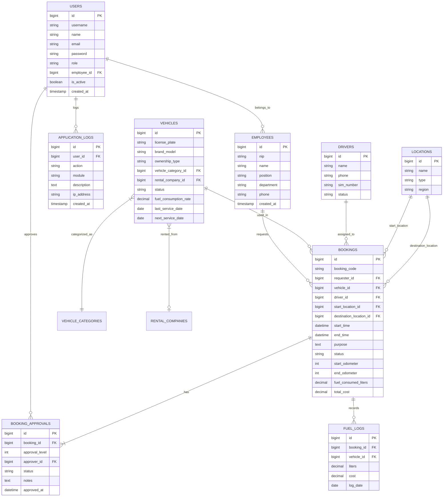
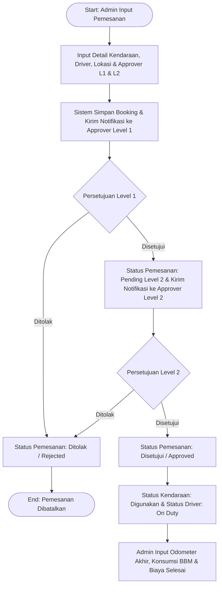

# 🚚 Sistem Pengelolaan & Pemesanan Kendaraan Operasional (Perusahaan Nikel)

[](https://php.net)
[](https://laravel.com)
[](https://postgresql.org)
[](https://tailwindcss.com)
[](https://alpinejs.dev)
[](LICENSE)

Aplikasi web manajemen dan pemesanan kendaraan operasional berbasis **Laravel** yang dirancang khusus untuk memenuhi kebutuhan operasional perusahaan tambang nikel (1 Kantor Pusat, 1 Kantor Cabang, & 6 Tambang di beberapa daerah). Sistem ini mendukung pengelolaan armada kendaraan (milik perusahaan & sewa/rental), alur persetujuan pemesanan bertingkat (*multi-level approval*), pelaporan konsumsi BBM & servis, serta visualisasi grafik pemakaian kendaraan secara interaktif.

---

## 📋 Daftar Isi

- [Spesifikasi & Versi Tech Stack](#-spesifikasi--versi-tech-stack)
- [Daftar Akun (Username & Password)](#-daftar-akun-username--password)
- [Checklist Pemenuhan Soal Technical Test](#-checklist-pemenuhan-soal-technical-test)
- [Physical Data Model (ERD)](#-physical-data-model-erd)
- [Activity Diagram Pemesanan Kendaraan](#-activity-diagram-pemesanan-kendaraan)
- [Fitur Utama Aplikasi](#-fitur-utama-aplikasi)
- [Panduan Instalasi & Konfigurasi](#-panduan-instalasi--konfigurasi)
- [Panduan Penggunaan Aplikasi](#-panduan-penggunaan-aplikasi)
- [Pengujian & Maintenance](#-pengujian--maintenance)
- [Struktur Direktori Proyek](#-struktur-direktori-proyek)

---

## 🛠 Spesifikasi & Versi Tech Stack

Sistem dibangun menggunakan ekosistem teknologi terkini dengan spesifikasi sebagai berikut:

| Komponen | Teknologi / Package | Versi Teruji | Keterangan |
| :--- | :--- | :--- | :--- |
| **Bahasa Pemrograman** | PHP | `^8.3` / `8.4.4` | Mendukung PHP 8.3+ dan PHP 8.4 |
| **Framework Backend** | Laravel Framework | `13.32.0` (`^13.x`) | Framework MVC PHP modern |
| **Database Engine** | PostgreSQL / MySQL / SQLite | `PostgreSQL 14.5+` | Default koneksi di `.env` (Mendukung MySQL 8.0+ & SQLite 3.35+) |
| **Asset Bundler** | Vite | `^6.0` / `^8.0` | Bundler modul JS/CSS cepat |
| **Styling & UI** | Tailwind CSS & Alpine.js | `Tailwind ^3.4`, `Alpine ^3.4` | Desain modern, responsif, & interaktif |
| **Visualisasi Grafik** | ApexCharts | `^7.4.0` | Grafik statistik pemakaian kendaraan interaktif |
| **Export Excel** | Laravel Excel (`maatwebsite/excel`) | `^4.0` | Export laporan format XLSX |
| **Autentikasi** | Laravel Breeze (Customized) | `^2.4` | Sistem autentikasi session & role-based access |

---

## 🔑 Daftar Akun (Username & Password)

Secara bawaan (*default*), seeder aplikasi (`DatabaseSeeder`) menyediakan **3 akun dengan role berbeda** untuk keperluan pengujian alur persetujuan (*multi-level approval*).

> **Password default untuk seluruh akun:** `password`

| Username | Password | Role | Nama Lengkap | Email | Jabatan / Pegawai | Hak Akses Utama |
| :--- | :--- | :--- | :--- | :--- | :--- | :--- |
| **`admin`** | `password` | `admin` | Budi Santoso | `admin@nikel.co.id` | Manager Operational (EMP-001) | Full Access: Tambah/Edit/Hapus Kendaraan, Driver, Perusahaan Sewa, Lokasi, User, Buat Pemesanan, Selesaikan Perjalanan, Export Excel, Log Aktivitas |
| **`approver1`** | `password` | `approver` | Ahmad Dahlan | `approver1@nikel.co.id` | Head of Mining Region 1 (EMP-002) | Atasan Level 1: Lihat Dashboard Statistik, Persetujuan/Penolakan Pemesanan Tahap 1 + Catatan |
| **`approver2`** | `password` | `approver` | Siti Rahmawati | `approver2@nikel.co.id` | VP Operations (EMP-003) | Atasan Level 2: Lihat Dashboard Statistik, Persetujuan/Penolakan Pemesanan Tahap 2 (Final) + Catatan |

---

## 📊 Checklist Pemenuhan Soal Technical Test

Berikut adalah pemenuhan seluruh butir persyaratan yang diminta pada lembar soal **Technical Test - Fullstack Developer**:

| No | Persyaratan Soal / Instruksi | Status | Implementasi pada Aplikasi |
| :---: | :--- | :---: | :--- |
| **a** | Terdapat 2 user (admin dan pihak yang menyetujui) | ✅ TERPENUHI | Multi-role user: Role `admin` & Role `approver` |
| **b** | Admin dapat menginput pemesanan, menentukan driver & approver | ✅ TERPENUHI | Form `bookings.create` memilih driver & approver Level 1 & Level 2 |
| **c** | Persetujuan dilakukan berjenjang minimal 2 level | ✅ TERPENUHI | Workflow 2-level: `Level 1 (Head of Mining)` -> `Level 2 (VP Operations)` |
| **d** | Pihak yang menyetujui dapat melakukan persetujuan via aplikasi | ✅ TERPENUHI | Dashboard `/approvals` khusus role approver untuk Approve/Reject + Catatan |
| **e** | Terdapat dashboard yang menampilkan grafik pemakaian kendaraan | ✅ TERPENUHI | ApexCharts grafik batang statistik pemakaian kendaraan (Filter: Harian, Mingguan, Bulanan) |
| **f** | Laporan periodik pemesanan kendaraan yang dapat di-export (Excel) | ✅ TERPENUHI | Halaman `/reports` dengan rentang tanggal & tombol Export Excel `.xlsx` |
| **g** | File README berisi username-password, DB, PHP, framework, & panduan | ✅ TERPENUHI | Dokumentasi lengkap pada file `README.md` |
| **Bonus a** | Physical Data Model (ERD) | ✅ TERPENUHI | Diagram ERD lengkap pada README & Walkthrough |
| **Bonus b** | Activity Diagram fitur pemesanan kendaraan | ✅ TERPENUHI | Diagram aktivitas alur pemesanan pada README & Walkthrough |
| **Bonus c** | Log aplikasi pada tiap proses | ✅ TERPENUHI | Audit trail pada modul `/logs` mencatat aksi pengguna & transaksi |
| **Bonus d** | UI/UX yang baik dan responsive | ✅ TERPENUHI | Layout modern berbasis Tailwind CSS, glassmorphism, & modal interaktif |

---

## 📐 Physical Data Model (ERD)



---

## 🔄 Activity Diagram Pemesanan Kendaraan



---

## ✨ Fitur Utama Aplikasi

### 1. 📊 Dashboard Analytics Interaktif
- Ringkasan statistik jumlah pemesanan (Total, Pending, Disetujui, Selesai).
- Grafik batang (*bar chart*) pemakaian kendaraan yang dapat difilter berdasarkan periode **Harian**, **Mingguan**, dan **Bulanan**.

### 2. 🚦 Alur Persetujuan Bertingkat (Multi-Level Approval)
- Pemesanan wajib disetujui oleh 2 tingkat atasan: **Approver Level 1** dan **Approver Level 2**.
- Notifikasi status real-time (`Pending Level 1`, `Pending Level 2`, `Approved`, `Rejected`).
- Catatan alasan pembatalan/penolakan jika pemesanan ditolak.

### 3. 🚗 Manajemen Armada Kendaraan (Vehicles)
- Pemisahan jenis kepemilikan kendaraan: **Milik Perusahaan** dan **Sewa (Rental)**.
- Kategori kendaraan: **Angkutan Orang** (SUV, Bus) & **Angkutan Barang** (Dump Truck, Pick-up).
- Status kondisi kendaraan (Tersedia, Digunakan, Dalam Perawatan/Servis).
- Riwayat konsumsi BBM dan jadwal servis berkala.

### 4. 👨‍✈️ Manajemen Driver & Perusahaan Sewa
- Pengelolaan data pengemudi operasional (SIM, Kontak, Status Ketersediaan).
- Pengelolaan data penyedia kendaraan sewa (Vendor Rental).

### 5. 📍 Manajemen Lokasi Operasional
- Penataan area tambang (6 lokasi tambang), kantor cabang, dan kantor pusat perusahaan nikel.

### 6. 📑 Pelaporan & Export Excel
- Filter laporan pemesanan kendaraan berdasarkan rentang tanggal.
- Export laporan ke format spreadsheet `.xlsx` secara langsung.

### 7. 📜 Audit Trail Log Aplikasi
- Pencatatan aktivitas transaksi dan perubahan data penting dalam sistem.

---

## 🚀 Panduan Instalasi & Konfigurasi

Ikuti langkah-langkah berikut untuk menjalankan proyek di lingkungan lokal:

### 1. Clone Repository & Masuk ke Folder Proyek
```bash
git clone <repository_url>
cd test-sekawan
```

### 2. Install Dependensi PHP & Node.js
```bash
composer install
npm install
```

### 3. Setup File Environment (`.env`)
Salin file `.env.example` menjadi `.env` dan jalankan pembuat kunci aplikasi:
```bash
cp .env.example .env
php artisan key:generate
```

### 4. Konfigurasi Database di `.env`

Sistem mendukung PostgreSQL, MySQL, dan SQLite.

**Contoh Konfigurasi PostgreSQL (Rekomendasi):**
```env
DB_CONNECTION=pgsql
DB_HOST=127.0.0.1
DB_PORT=5432
DB_DATABASE=test-sekawan
DB_USERNAME=postgres
DB_PASSWORD=password_anda
```

**Contoh Konfigurasi SQLite (Praktis tanpa instalasi DB server):**
```env
DB_CONNECTION=sqlite
```
*(Catatan: Buat file kosong `database/database.sqlite` jika menggunakan SQLite).*

### 5. Menjalankan Migration & Seeder Data Awal
Jalankan perintah berikut untuk membuat struktur tabel dan mengisikan data awal (User, Kendaraan, Driver, Lokasi, Contoh Pemesanan):
```bash
php artisan migrate:fresh --seed
```

### 6. Menjalankan Server Aplikasi
Jalankan PHP Artisan Development Server dan Vite Asset Compiler secara bersamaan:

**Terminal 1 (Laravel Development Server):**
```bash
php artisan serve
```

**Terminal 2 (Vite Compiler):**
```bash
npm run dev
```

Atau menggunakan perintah terintegrasi:
```bash
npm run dev
# dan di terminal terpisah: php artisan dev
```

Akses aplikasi di browser melalui URL: **`http://127.0.0.1:8000`**

---

## 📖 Panduan Penggunaan Aplikasi

### Sebagai Admin (`username: admin`)
1. **Login** menggunakan username `admin` dan password `password`.
2. **Kelola Data Master**: Tambahkan data Kendaraan, Driver, Perusahaan Sewa, Lokasi, dan Kategori melalui menu di sidebar.
3. **Membuat Pemesanan Kendaraan**:
   - Buka menu **Pemesanan Kendaraan** -> Klik **+ Tambah Pemesanan**.
   - Isi form pemesanan: Tujuan Perjalanan, Tanggal Berangkat & Kembali, Kendaraan, Driver.
   - **Pilih Atasan Level 1** (misal: Ahmad Dahlan) dan **Atasan Level 2** (misal: Siti Rahmawati).
   - Klik **Simpan Pemesanan**. Status awal akan menjadi `Pending Level 1`.
4. **Selesaikan Pemesanan**:
   - Setelah pemesanan disetujui oleh kedua atasan, saat perjalanan selesai klik tombol **Selesaikan**.
   - Input Odometer Akhir, Jumlah Konsumsi BBM (Liter), Total Biaya BBM/Tol, dan Catatan Kondisi Kendaraan.
5. **Cetak Laporan**:
   - Buka menu **Laporan**, tentukan rentang tanggal, lalu klik **Export Excel** untuk mengunduh laporan.

### Sebagai Approver Level 1 (`username: approver1`)
1. **Login** menggunakan username `approver1` dan password `password`.
2. Buka menu **Persetujuan (Approvals)**.
3. Anda akan melihat daftar pemesanan yang menunggu persetujuan Level 1.
4. Klik tombol **Setujui (Approve)** atau **Tolak (Reject)** dan masukkan catatan jika diperlukan.
5. Setelah disetujui, status akan berubah menjadi `Pending Level 2`.

### Sebagai Approver Level 2 (`username: approver2`)
1. **Login** menggunakan username `approver2` and password `password`.
2. Buka menu **Persetujuan (Approvals)**.
3. Anda akan melihat daftar pemesanan yang telah disetujui Level 1 dan menunggu persetujuan final (Level 2).
4. Klik **Setujui (Approve)**. Status pemesanan resmi menjadi `Approved` dan kendaraan siap digunakan.

---

## 🧪 Pengujian & Maintenance

### Menjalankan Automated Tests (PHPUnit)
```bash
php artisan test
```

### Formatting Code Standard (Laravel Pint)
```bash
vendor/bin/pint
```

### Build Production Assets
```bash
npm run build
```

---

## 📁 Struktur Direktori Utama Proyek

```text
test-sekawan/
├── app/
│   ├── Http/
│   │   ├── Controllers/         # Controller aplikasi (Booking, Approval, Vehicle, dll.)
│   │   └── Middleware/          # Role middleware & autentikasi
│   ├── Models/                  # Eloquent Model (User, Vehicle, Booking, Driver, dll.)
│   └── Exports/                 # Class Export Excel (Laravel Excel)
├── database/
│   ├── migrations/              # Skema tabel database
│   └── seeders/                 # Seeder data awal (User, Vehicle, Driver, Booking, dll.)
├── resources/
│   ├── views/                   # Template Blade UI (Layouts, Components, Vehicles, dll.)
│   └── css/ & js/               # Asset frontend (Tailwind CSS, Alpine.js, ApexCharts)
├── routes/
│   └── web.php                  # Routing aplikasi web
├── tests/                       # Unit & Feature Test Suite
├── .env.example                 # Template konfigurasi environment
├── composer.json                # Pengaturan dependensi PHP/Laravel
├── package.json                 # Pengaturan dependensi JavaScript & Vite
└── README.md                    # Dokumentasi utama aplikasi
```

---

<p align="center">
  <i>Dikembangkan untuk Technical Test Fullstack Developer (Intern) - Sistem Manajemen & Pemesanan Kendaraan Operasional Perusahaan Nikel.</i>
</p>
